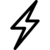

# Activity

The image selected for this experiment is the following:

## Build a regular grid

First of all, I have processed the thunder image and build a graph from
the binarized image, resulting in [next graph](fig:3DnormLapl3clusters).
As we may observe, we have obtained an undirected connected graph and
there are no isolated communities.

## Spectral analysis of the undirected unweighted graph

In the Graph Fourier Transform the eigenvalues take the role of the
frequencies and the eigenvectors the Fourier basis. In the image below,
we may notice the relation between eigenvalues and spatial variation
across the graph. We can observe from the second eigenvector how the
graph starts to project where the variations are higher or lower
depending on the edges weights.

Now, we can plot the representation of graph signals in 3D. So the
resulting image is the following for the second eigenvector:

## Next eigenvectors as graph signals

Let's see what happens in the following eigenvectors.

We can also plot the representation of graph signals in 3D for such
eigenvectors. Hence, in the resulting image for the 6th eigenvector we
may observe a variation in the edges of the thunder where the variation
has been split up and localized in 4 parts:

## Adding new edges

To the initial graph we have added some new edges: \[43 17; 31 14; 30
11; 45 15; 31 19; 28 16; 46 18\]; The resulting graph with this
modifications is the following:

With that variation, if we observe the Spectral representation we can
observe the change across the graph, since the signal is going to be
projected differently. Hence, we can appreciate such a behaviour in the
image below:

If we focus on the following eigenvectors composition, we can see that
the variation keeps propagating across the graph and the variation
really changes the projection. In the initial graph we found a symmetric
convergence in the graph on the edges of the thunder, however in the
graph with more edges we notice that there more variation on the part
where the new edges have been added, which makes totally sense.

